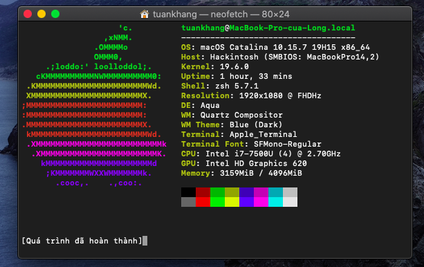

## DELL VOSTRO 3568 i7
**OpenCore Version**: [0.6.4](https://github.com/acidanthera/OpenCorePkg/releases)

**macOS Version**: macOS Catalina 10.15.7 / Big Sur 11.1

### Hardware Status

| Hardware                   | Status                                                      |
| ----------------------     | ------------------------------------------------------------|
| CPU - i7                   | Working                                                     |
| GPU - Intel HD Graphics 620| Working                                                     |
| Screen - 1920x1080         | Working                                                     |
| RAM - 4GB                  | Working                                                     |
| SSD - 128G                 | Working                                                     |
| Audio - ALC265             | Working - headphones jack need to be fixed by [COMBOJACK](https://github.com/tuankhang99/VOSTRO-3568-EFI/tree/main/ComboJack_Installer)|                              
| Wireless - Intel 3165      | Working - intel wifi fixed by [INTEL](https://github.com/OpenIntelWireless/itlwm/releases/tag/v1.2.0-alpha)|                                                                                                                            
| Battery                    | Working                                                     |                  
| USB                        | Working - mapped usb                                        |
| HotKeys                    | Working - mute F1, volume F2/F3, keyboard brightness F11,F12|
| Webcam                     | Working                                                     |
| Laptop KeyBoard            | Working                                                     |
| Laptop Trackpad            | Working                                                     |
| Sleep                      | Working                                                     |
| Fingerprint Sensor         | Not working                                                 |

### CPU Power Management

This Patch non-add [CPU](https://github.com/tuankhang99/VOSTRO-3568-EFI/tree/main/DSDT%20no%20freq%20CPU) frequency-data 
